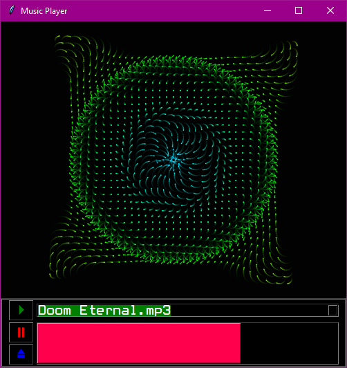

# Simple Music Player

This script implements a simple music player GUI using Tkinter in Python. The player allows users to load songs from a directory, play the file, and stop the song. The app also has a cool-looking rainbow-colored progress bar effect to show the elapsed time of the song. Here's a breakdown of the functionalities and how to use the script:

## Features:

- GUI window with buttons and controls.
- Load songs from a directory.
- Play songs once loaded.
- Display progress of the currently playing song with a pretty rainbow-colored progress bar.

## Prerequisites:

- Python 3.x installed.
- Required Python packages: tkinter, Pillow (PIL), pygame.

**Using the Music Player**:

   - Upon running the script, a window titled "Music Player" will appear.
   - Press the ⏏️ button to select a directory containing music files.
   - Select the song in the dropdown menu once the songs are loaded in the application.
   - Once songs are loaded, use the ▶️ button to play a selected song, ⏸️ button to stop the current song.
   - The progress bar displays the current progress of the playing song.
   - While a song is playing, a rainbow-colored effect will be displayed on the progress bar.

## Notes:

- Supported file formats: The player supports common audio file formats like mp3, wav, etc.
- Ensure the directory you select contains music files.
- I don't plan on adding much more to this project, such as song scrubbing, autoplay, shuffle, pause/resume, etc. This project was mainly to get some hands-on skills with configuring GUI for Python scripts/apps.
